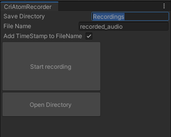
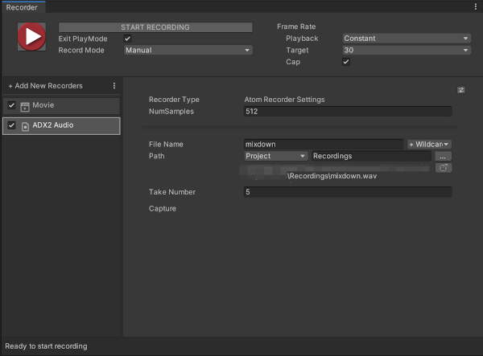

# ADX2 for Unity Recorder
ADX2 for Unityで再生中の音を録音するエディタ拡張

### 単体録音ウィンドウ

### Unity Recorder用拡張

## 動作確認環境
- Unity 2020.1.0f1
- Unity Recorder 2.2.0-preview
- ADX2 LE SDK 2.10.06

## エディタでの使用方法
Window/CRIWARE/CriAtomRecorderからツールウィンドウを呼び出すことができます。
ゲームを再生開始し、任意のタイミングで「Start Recording」ボタンを押してください。

### Unity Recorderとの連携方法
Unity Recorderを開き、+Add New RecordersからADX2 Audioを選択します。
Movieと同時に録音するときは、Movie側のCapture Audioのチェックを外してください。

MP4と同タイミングで録音されますが、キャプチャ精度やデータロードタイミングの都合上、MP4より長めのデータが録れます。

## ランタイムでの使用方法
CriAtomRecorder.csを任意のゲームオブジェクトにアタッチし、録音したいタイミングでStartRecordメソッドを叩いてください。その際はプラットフォームごとの保存可能ファイルパスを指定して渡す必要があります。

/Sampleに日付時刻を入れたwavファイルをApplication.persistentDataPathに保存するサンプルを用意しています。このスクリプトを適当なゲームオブジェクトにアタッチし、OnRecordStartメソッドをボタンイベントなどにアサインすることで、録音をかんたんにテストできます。

## 今後のアップデート
- ~~Unity Recorderが拡張可能になったら対応~~ done.
- 出力されたwavをどうにかしてmp4とくっつける方法を探す：MovieEncoderのソースを丸コピーすればできそうだけどグレーっぽい
